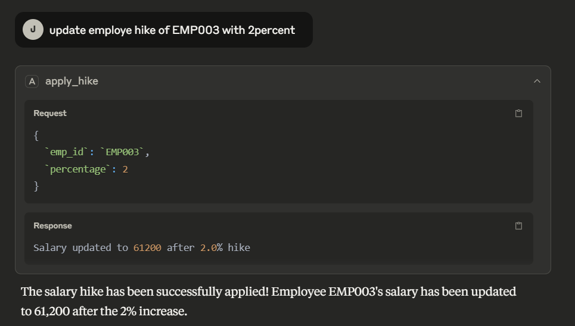

# MCP Servers

## Server 1 HR Management Application
### ✅ Deployment Summary (Recap & Validation)

Here’s a summary checklist to ensure your setup is properly ready to run via Claude Desktop:

---

#### ✅ **Code Review (main.py)**

* Uses `FastMCP` from `mcp.server.fastmcp`
* Functions are well-decorated with `@mcp.tool()` or `@mcp.resource()`
* Dummy employee records are rich and realistic
* Handles edge cases like invalid input types and missing employees

---

#### ✅ **Local MCP App Setup**

You did all the following correctly:

1. Created virtual environment → `.venv/`
2. Installed dependencies with `uv`:

   ```bash
   pip install mcp[cli]
   pip install --upgrade typer
   uv pip install -r requirements.txt  # if needed
   ```
3. Registered the app:

   ```bash
   uv run mcp install main.py
   ```

---

#### ✅ **Claude Desktop Integration**

When you install with:

```bash
uv run mcp install main.py
```

→ it automatically updates **Claude Desktop’s `config.json`**, registering your app as:

```
Joshua EdTech HR Management Server
```

Then, you simply start **Claude Desktop** and interact via:

```
> What is the leave balance of EMP007?
> Apply 10% hike for EMP003.
> Update role of EMP010 to Project Lead.
```

Claude will route those through your `main.py` MCP server. ✅

---

### 📁 Project Layout Validation (from your screenshot)

```
hr_AppIn_MCP/
├── .venv/                # Virtual environment
├── __pycache__/          # Bytecode cache
├── .gitignore
├── .python-version
├── main.py               ✅ MCP server code
├── pyproject.toml        ✅ Optional for dependency tracking
├── README.md             ✅ Optional doc
├── uv.lock               ✅ Dependency lock
```

Looks perfect and clean. 👍

---

## 🧠 Server 2 MCP Demo Projects (Memory-Enabled Chat with MCP Tools)

This project is a simple demonstration of using [LangChain MCP (Multi-Component Processors)](https://smith.langchain.com/) with a memory-enabled chat agent. It uses **Cursor** as the MCP Host, a terminal-based **MCP client**, and three MCP-compatible servers:

* `@playwright/mcp`
* `@openbnb/mcp-server-airbnb`
* `duckduckgo-mcp-server`

The LLM used is [`ChatGroq`](https://www.groq.com/) with the model `qwen-qwq-32b`.

---

### 📂 Project Structure

```bash
mcpdemo/
├── .env                  # Environment variables (contains GROQ_API_KEY)
├── .gitignore
├── .python-version
├── browser_mcp.json      # Configuration of MCP servers
├── main.py               # Main async Python script for chat loop
├── pyproject.toml        # Project dependencies managed with `uv`
├── README.md             # (This file)
├── uv.lock               # Lock file for reproducible environments
└── .venv/                # (Optional) Python virtual environment
```

---

### ⚙️ Requirements

* Python 3.10+

* [`uv`](https://github.com/astral-sh/uv) (recommended package manager)

* A `.env` file with your Groq API Key:

  ```
  GROQ_API_KEY=your_groq_api_key_here
  ```

* Node.js (for `npx` to run MCP servers)

* Internet connection to pull MCP servers via `npx`

---

### 🚀 Setup Instructions

#### 1. Clone the Repository

```bash
git clone https://github.com/DINAKAR-S/MCP-Servers.git
cd mcpdemo
```

#### 2. Set Up Virtual Environment (optional but recommended)

```bash
python -m venv .venv
source .venv/bin/activate  # For Unix/macOS
# OR
.venv\Scripts\activate     # For Windows
```

#### 3. Install Dependencies Using `uv`

```bash
uv pip install -r requirements.txt
# OR use pyproject.toml directly
uv venv .venv
uv pip install -e .
```

Or to add libraries:

```bash
uv pip install langchain_groq python-dotenv
```

#### 4. Add Your API Key

Create a `.env` file:

```
GROQ_API_KEY=your_groq_api_key_here
```

#### 5. Run MCP Host in Cursor Editor

Open Cursor and launch **MCP Host** (built-in feature in Cursor).

#### 6. Run the MCP Client from Terminal

```bash
uv run main.py
```

---

### 🛠️ MCP Server Configuration (in `browser_mcp.json`)

```json
{
  "mcpServers": {
    "playwright": {
      "command": "npx",
      "args": ["@playwright/mcp@latest"]
    },
    "airbnb": {
      "command": "npx",
      "args": ["-y", "@openbnb/mcp-server-airbnb"]
    },
    "duckduckgo-search": {
      "command": "npx",
      "args": ["-y", "duckduckgo-mcp-server"]
    }
  }
}
```

This file tells the MCP client how to launch the required servers.

---

### 💬 Usage

Run the client:

```bash
uv run main.py
```

You'll see:

```
Welcome to the MCP Demo!
Type 'exit' or 'quit' to exit the conversation.
Type 'clear' to clear the history of conversation.
=================================================

You:
```

* Type your queries.
* Use `"clear"` to clear memory.
* Use `"exit"` or `"quit"` to end the session.

---

### 📦 Installed Libraries

* [`langchain_groq`](https://github.com/langchain-ai/langchain) - Integration with Groq models
* `python-dotenv` - For loading environment variables
* `asyncio` - For running async tasks

---

### 📸 Preview



---

### 📄 License

This project is licensed under the MIT License.

---

### 🙌 Acknowledgements

* [LangChain MCP](https://smith.langchain.com/)
* [Groq LLM](https://www.groq.com/)
* [Cursor IDE](https://www.cursor.sh/)
* [uv - Lightning-fast Python packaging](https://github.com/astral-sh/uv)

